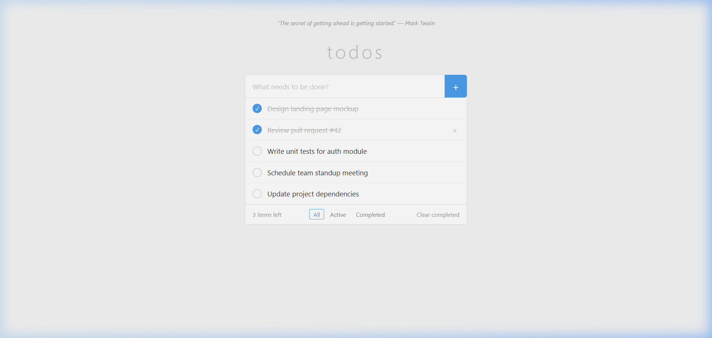
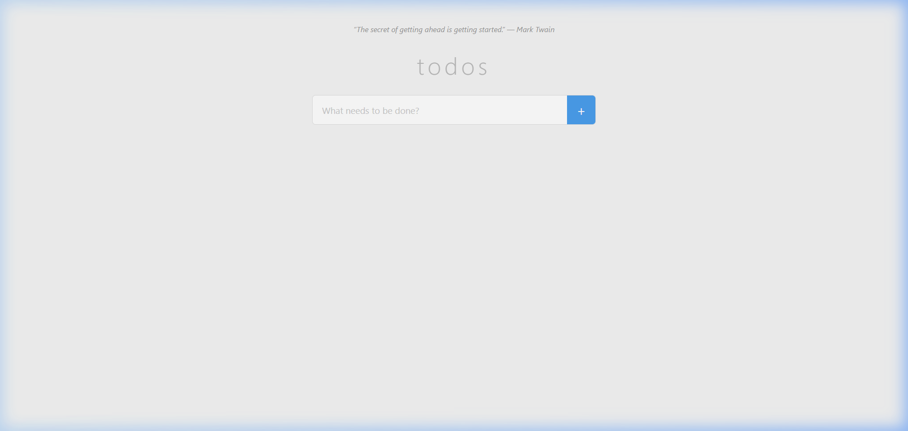
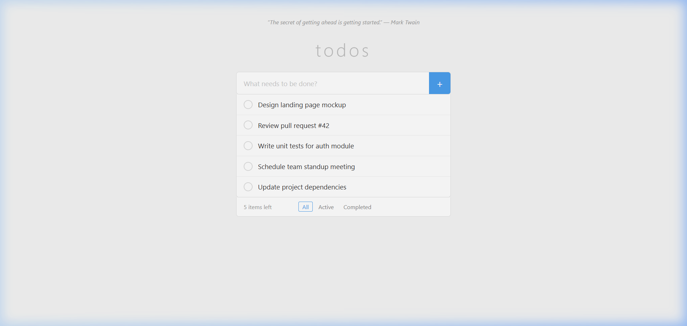
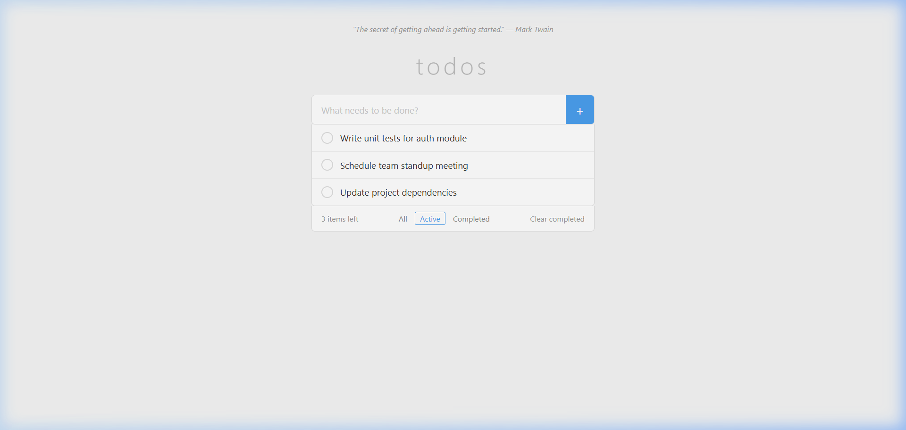
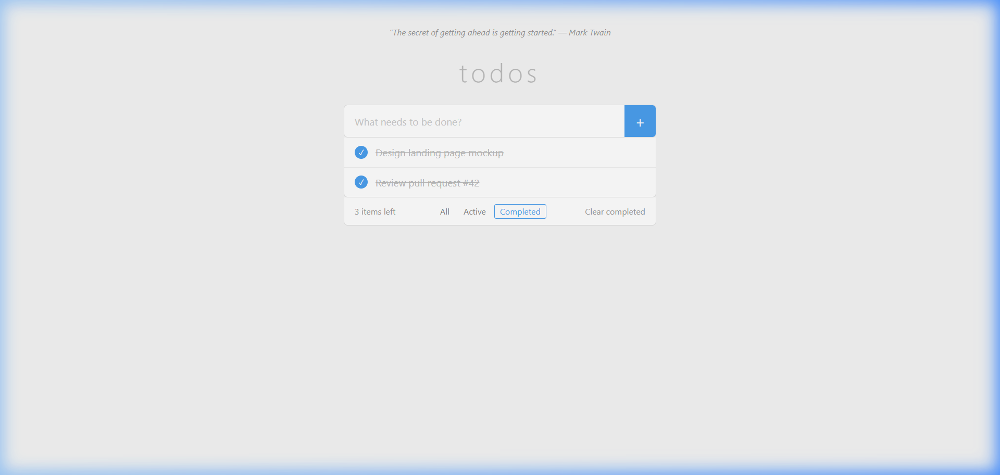
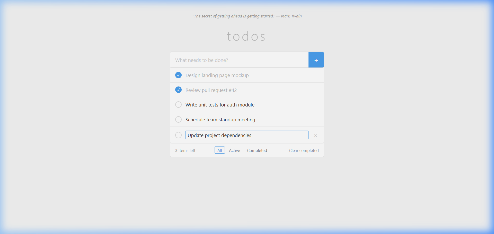

# To-Do

A minimal, elegant to-do list application built with vanilla HTML, CSS, and JavaScript. No frameworks, no build tools, no dependencies — just open `index.html` and go.



---

## Features

- **Add tasks** via text input + button or Enter key
- **Toggle completion** with a click on the checkbox (strikethrough styling)
- **Inline editing** — double-click any task text to edit in place
- **Delete tasks** with the × button on hover
- **Filter views** — switch between All, Active, and Completed
- **Live count** of remaining active items
- **Clear completed** — bulk-remove finished tasks in one click
- **Persistent storage** — full state saved to `localStorage` on every change
- **Daily quote** — fetches a random quote on page load via the Fetch API, with a graceful fallback

---

## Screenshots

### Empty State
Clean starting point with the daily quote banner.



### All Todos
Five tasks added, with the active item count and footer controls visible.



### Completed & Active Mix
Two tasks marked as done — strikethrough styling and the blue checkbox indicate completion.


### Active Filter
Only incomplete tasks are shown when the "Active" filter is selected.



### Completed Filter
Only finished tasks are shown when the "Completed" filter is selected.



### Inline Editing
Double-click a task to enter edit mode. Press Enter to save, Escape to cancel.



---

## Getting Started

1. Clone or download this repository
2. Open `index.html` in any modern browser

That's it. No `npm install`, no build step, no server required.

---

## File Structure

```
To-do Application/
├── index.html       — Semantic HTML structure
├── style.css        — Minimal, responsive styles
├── script.js        — All application logic (IIFE-wrapped)
├── screenshots/     — App screenshots
└── README.md
```

---

## Tech Stack

| Layer     | Technology           |
|-----------|----------------------|
| Structure | HTML5                |
| Styling   | Vanilla CSS3         |
| Logic     | Vanilla JavaScript (ES6+) |
| Storage   | localStorage         |
| API       | Fetch API (daily quote) |

---

## Design Principles

- **No dependencies** — runs entirely self-contained in any browser
- **System font stack** — `-apple-system, Segoe UI, Roboto, sans-serif` for native feel
- **Single accent color** — `#4a9eed` used sparingly for checkmarks, active filters, and the add button
- **Subtle transitions** — 150ms ease transitions on add, remove, and toggle actions
- **Event delegation** — a single listener on the list container handles all item interactions
- **Proper DOM construction** — `createElement` / `createDocumentFragment`, no `innerHTML` string-building

---

## Keyboard Shortcuts

| Action             | Key            |
|--------------------|----------------|
| Add a todo         | `Enter`        |
| Save inline edit   | `Enter`        |
| Cancel inline edit | `Escape`       |
| Start inline edit  | `Double-click` |

---

## Browser Support

Works in all modern browsers — Chrome, Firefox, Safari, Edge. No polyfills needed.

---

## License

MIT
